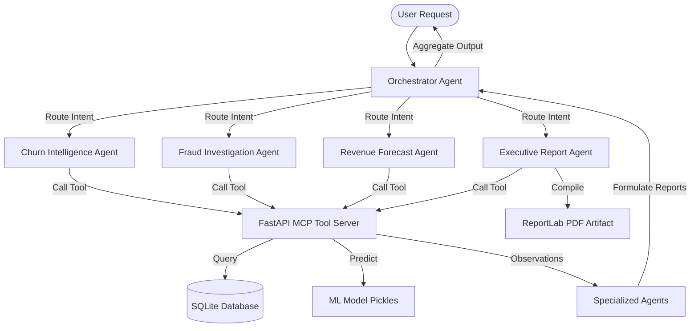
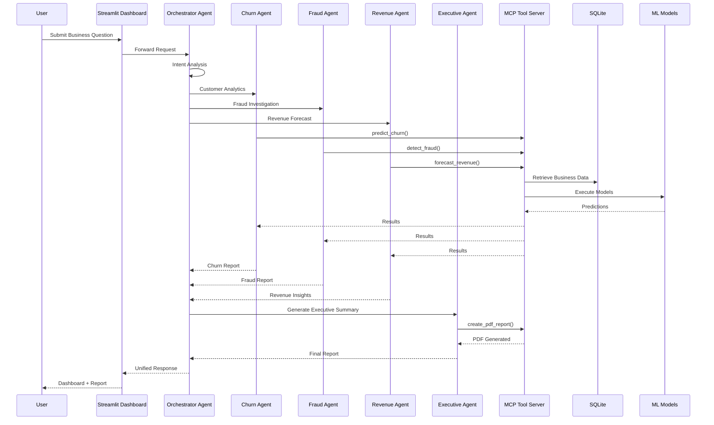
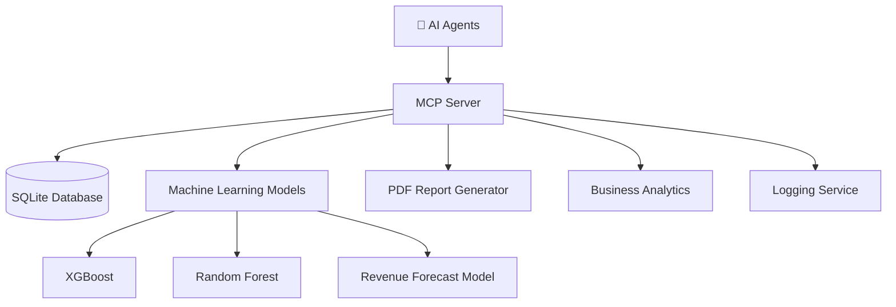
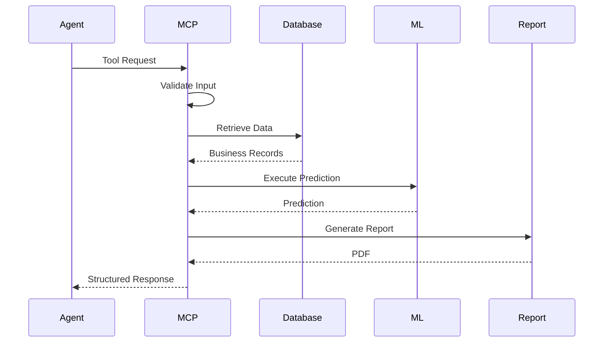
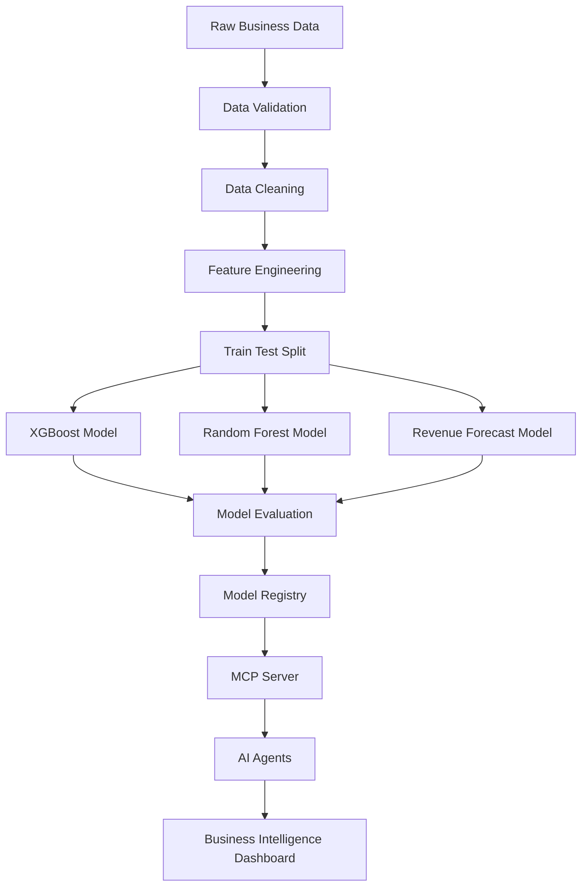
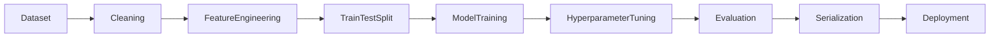

# 🤖 InsightPilot – Multi-Agent Business Intelligence (BI) Platform

InsightPilot is a production-ready, fully-offline Multi-Agent Business Intelligence platform built for the **Kaggle AI Agents Capstone (Agents for Business track)**. 

The platform orchestrates a team of specialized cognitive agents (Orchestrator, Churn Success, Fraud compliance, and FP&A forecasting) to query relational databases, execute machine learning classifiers, and compile executive PDF briefings—all running entirely on local CPU resources with **zero external API key requirements**.

---

## 1. Project Overview & Business Impact

Modern enterprises suffer from siloed data and slow analytical response cycles. InsightPilot solves this by creating a collaborative team of specialized AI agents that interact with data lakes through standardized **Model Context Protocol (MCP)** tool APIs:

*   **SaaS Customer Success (Churn Agent):** Utilizes XGBoost models to calculate subscription churn risk and details key risk drivers (e.g., tenure, pricing, contract terms) using explainable SHAP values.
*   **Compliance & Risk Operations (Fraud Agent):** Analyzes transaction records using a Random Forest model, detecting coordinate-based geolocation deviations, anomalous spending, and nocturnal wire attempts.
*   **Corporate Forecasting (FP&A Revenue Agent):** Fits regression trends with 12-month cyclical Fourier features to project future monthly recurring revenue (MRR) along with 95% confidence intervals.
*   **Executive Leadership (Executive Agent):** Gathers cross-domain statistics and compiles publication-quality PDF corporate briefing documents using ReportLab.

---

## 2. Platform Architecture

InsightPilot's offline agent framework operates using a modular ReAct (Reasoning and Acting) execution pattern:



---

## 3. Directory Layout

The project follows a clean, production-grade folder structure:

```
├── config/
│   └── settings.py              # Environment configuration loader
├── database/
│   ├── db_manager.py            # SQLite database helper and agent logs auditor
│   ├── schema.sql               # SQLite database schemas
│   └── insightpilot.db          # SQLite Database file (auto-generated)
├── data/
│   ├── saas_churn.csv           # Raw generated SaaS subscriber profiles
│   ├── financial_transactions.csv# Raw generated credit transactions
│   └── executive_report.pdf     # Generated PDF briefing (auto-generated)
├── scripts/
│   ├── generate_data.py         # Synthetic customer and transaction data generator
│   └── train_models.py          # Preprocessing, ML training, and pickle exporter
├── models/
│   ├── churn_model.pkl          # Trained XGBoost churn classifier
│   ├── fraud_model.pkl          # Trained Random Forest fraud classifier
│   └── revenue_forecast.pkl     # Trained Ridge MRR forecaster
├── agents/
│   ├── __init__.py
│   ├── base_agent.py            # Custom SimulatedAgent class with cognitive logs
│   ├── orchestrator.py          # Dynamic coordinator and query router
│   ├── churn_agent.py           # Subscriber churn success analyst
│   ├── fraud_agent.py           # Transaction fraud investigator
│   ├── revenue_agent.py         # Revenue forecaster (FP&A)
│   └── executive_agent.py       # Corporate executive reporter
├── mcp_server/
│   ├── __init__.py
│   └── main.py                  # FastAPI implementation of MCP tool endpoints
├── frontend/
│   ├── app.py                   # Streamlit main entrypoint
│   └── pages/                   # Multi-page dashboard layouts
│       ├── 1_executive_overview.py
│       ├── 2_customer_churn.py
│       ├── 3_fraud_intelligence.py
│       ├── 4_revenue_forecasting.py
│       ├── 5_agent_chat.py
│       ├── 6_pdf_report.py
│       └── 7_system_monitoring.py
├── deployment/
│   ├── Dockerfile
│   └── docker-compose.yml
├── requirements.txt
└── .env.example
```

---

## 4. Installation & Setup (Offline Local Run)

### Prerequisite
*   Python 3.10 or 3.11

### Step 1: Clone and Create Virtual Environment
```bash
git clone https://github.com/your-repo/InsightPilot.git
cd InsightPilot
python -m venv venv
# On Windows PowerShell:
.\venv\Scripts\Activate.ps1
```

### Step 2: Install Packages
```bash
pip install -r requirements.txt
```

### Step 3: Seed Database and Train ML Models
Run the data generator to create synthetic datasets and populate the SQLite database, then train the models:
```bash
python scripts/generate_data.py
python scripts/train_models.py
```

### Step 4: Run Streamlit Frontend & MCP server
You can start uvicorn to host the MCP server, and launch the Streamlit frontend.
To run the Streamlit frontend:
```bash
streamlit run frontend/app.py
```
To run the FastAPI MCP server separately (Optional, since the frontend runs all tool logic directly via Python functions for convenience):
```bash
uvicorn mcp_server.main:app --host 127.0.0.1 --port 8000
```

---

## 5. Security & Verification Features

1.  **State Audit Logs:** Every single cognitive step (Thought, Action, Observation, Output) executed by any agent is logged in the SQLite `agent_logs` table. This provides complete audit trails of AI agent operations.
2.  **Deterministic Route Planning:** The `OrchestratorAgent` uses strict intent checks to route analysis to the appropriate sub-agent, preventing unexpected executions.
3.  **Local Isolation:** Since no external model API calls are made, no corporate database details or customer identities ever leave the local network.

---

## 6. Future Work
*   **Local LLM Integration:** Bind simulated agent behaviors to local LLMs (e.g., Llama-3 or Gemma-2 via Ollama).
*   **Graph Database Integration:** Incorporate graph neural networks (GNNs) for transaction relation modeling.

---

# 🎬 Live Demo & Resources

<div align="center">

🎥 **Project Demo Video**

> Coming Soon *(YouTube – 5 Minute Walkthrough)*

🌐 **Live Demo**

> https://insight-pilot-frontend.onrender.com
> https://insightpilot-backend-j43w.onrender.com

📂 **GitHub Repository**

> https://github.com/yourusername/InsightPilot


# 📸 Platform Preview
--
[


--

# ⚡ Quick Highlights

| Feature                     | Description                                                       |
| --------------------------- | ----------------------------------------------------------------- |
| 🤖 Multi-Agent System       | Five specialized AI agents collaborate to solve business problems |
| 🔌 Google ADK               | Agent orchestration using Google Agent Development Kit            |
| 🛠 MCP Server               | Secure business tools exposed through Model Context Protocol      |
| 📊 Machine Learning         | XGBoost, Random Forest, and Revenue Forecasting models            |
| 📈 Interactive BI Dashboard | Modern Streamlit interface with real-time visualizations          |
| 🛡 Security                 | Local execution, audit logs, validation, and safe tool routing    |
| 📄 Executive Reports        | Automated PDF generation for leadership teams                     |
| 🐳 Production Ready         | Docker support and reproducible deployment                        |

---

# 🎯 What Can InsightPilot Do?

✅ Predict customer churn before customers leave

✅ Detect fraudulent financial transactions

✅ Forecast future revenue trends

✅ Generate executive-ready PDF reports

✅ Answer natural language business questions

✅ Coordinate multiple AI agents through a central orchestrator

✅ Operate completely offline with locally trained ML models

✅ Provide explainable AI insights for business decision-making

  
## 7. # 🤖 Why AI Agents?

## Beyond Traditional Business Intelligence

Traditional Business Intelligence platforms are excellent at visualizing historical data, creating dashboards, and generating static reports. However, they generally require users to manually navigate dashboards, interpret charts, correlate insights across multiple systems, and decide what actions should be taken next.

Similarly, conventional AI assistants often rely on a single monolithic model that attempts to solve every task, making them difficult to scale, maintain, and specialize for complex enterprise workflows.

InsightPilot takes a fundamentally different approach.

Instead of relying on a single AI model, the platform is built around a **collaborative Multi-Agent Architecture** where each agent is responsible for a specialized business domain.

---

# 🧠 Why Multi-Agent Systems?

Real-world business problems rarely belong to a single department.

For example, a simple executive question such as:

> *"Why did revenue decline this quarter, which customers are likely to churn, and should we investigate any fraudulent activity?"*

cannot be answered by a single analytical process.

It requires expertise from multiple business functions, including:

* Customer Success
* Finance
* Risk & Compliance
* Executive Reporting

InsightPilot mirrors this organizational structure by assigning dedicated AI agents to each business domain.

Each agent contributes its expertise, while the Orchestrator Agent coordinates communication and combines the outputs into a unified business response.

This collaborative approach makes the system:

* More modular
* Easier to maintain
* Easier to extend
* More explainable
* Better aligned with enterprise workflows

---

# 🤝 Collaborative Agent Workflow

Rather than working independently, InsightPilot's agents collaborate to solve complex business problems.

### Example Workflow

```text
Executive Question

        │

        ▼

Orchestrator Agent

        │

 ┌──────┼──────────┬────────────┐
 ▼      ▼          ▼            ▼

Churn  Fraud    Revenue    Executive
Agent  Agent    Agent      Agent

        │

        ▼

      MCP Tools

        │

        ▼

 Machine Learning Models

        │

        ▼

 SQLite Business Database

        │

        ▼

 Unified Executive Report
```

Each specialized agent focuses exclusively on its domain while sharing information through standardized MCP tools, ensuring that the final response combines multiple perspectives into one coherent business recommendation.


# 🌍 Real Business Benefits

By adopting a Multi-Agent architecture, organizations can:

* Reduce manual analytical effort.
* Accelerate executive decision-making.
* Improve customer retention through early churn detection.
* Detect financial fraud more efficiently.
* Generate consistent executive reports.
* Scale business analytics through modular AI components.
* Build secure, maintainable, and extensible AI systems.

---

# 💡 Design Philosophy

InsightPilot was designed around one core principle:

> **"Specialized AI agents working together can solve complex business problems more effectively than a single general-purpose assistant."**

This philosophy enables the platform to deliver intelligent, explainable, and production-inspired Business Intelligence while remaining modular, scalable, and easy to extend with additional agents in the future.

## 8.---

# 🤖 Multi-Agent Architecture

## Architecture Philosophy

InsightPilot is built on a **collaborative Multi-Agent Architecture**, where autonomous AI agents work together to solve complex business intelligence problems.

Instead of relying on a single general-purpose AI assistant, the platform distributes responsibilities across specialized agents. Each agent is an expert in a particular business domain and collaborates through a centralized orchestration layer and standardized MCP tools.

This architecture provides:

* Higher modularity
* Better scalability
* Easier maintenance
* Explainable decision-making
* Independent agent development
* Enterprise-grade extensibility

Research on multi-agent systems consistently shows that decomposing complex tasks into specialized agents improves modularity, coordination, and maintainability compared with monolithic designs.

---

---

# 🧭 Orchestrator Agent

## Responsibilities

The **Orchestrator Agent** acts as the central coordinator of the platform.

It is responsible for:

* Understanding user intent
* Breaking complex requests into subtasks
* Selecting the appropriate specialist agents
* Coordinating inter-agent communication
* Aggregating intermediate outputs
* Producing a unified business response

### Example

**User Query**

> "Which customers are most likely to churn, what revenue is at risk, and are there any suspicious transactions this month?"

The Orchestrator automatically delegates work to:

* Customer Churn Agent
* Revenue Forecast Agent
* Fraud Investigation Agent

Finally, it requests the Executive Agent to generate a consolidated report.

---

# 📈 Customer Churn Intelligence Agent

## Mission

Predict customer churn before customers cancel their subscriptions.

### Responsibilities

* Customer segmentation
* Churn prediction
* Risk scoring
* Customer lifetime analysis
* Retention strategy generation
* SHAP-based explanation of predictions

### Primary MCP Tools

* `predict_churn()`
* `get_customer_insights()`

### Machine Learning Model

* XGBoost Classifier

### Outputs

* Churn probability
* Risk category
* Top churn drivers
* Retention recommendations

---

# 🛡 Fraud Investigation Agent

## Mission

Protect organizations from financial fraud through intelligent transaction analysis.

### Responsibilities

* Fraud detection
* Risk classification
* Transaction anomaly detection
* Spending behavior analysis
* Geographic anomaly detection

### Primary MCP Tools

* `detect_fraud()`

### Machine Learning Model

* Random Forest Classifier

### Outputs

* Fraud score
* Fraud probability
* Suspicious transactions
* Investigation summary

---

# 💰 Revenue Forecast Agent

## Mission

Forecast future business performance using historical financial data.

### Responsibilities

* Revenue forecasting
* Growth prediction
* Trend analysis
* Financial planning support
* Confidence interval estimation

### Primary MCP Tools

* `forecast_revenue()`

### Machine Learning Model

* Regression Forecast Model

### Outputs

* Forecasted revenue
* Growth trend
* Financial projections
* Business outlook

---

# 📄 Executive Report Agent

## Mission

Transform analytical outputs into executive-ready business reports.

### Responsibilities

* Aggregate results from all agents
* Generate executive summaries
* Produce PDF reports
* Highlight strategic opportunities
* Recommend business actions

### Primary MCP Tools

* `generate_executive_report()`
* `create_pdf_report()`

### Outputs

* Executive summary
* Business recommendations
* PDF report
* Strategic action plan

---

# 🔄 Agent Collaboration Model

Each AI agent is intentionally independent.

Agents **never communicate directly with the database or machine learning models**.

Instead, every interaction is routed through the MCP Tool Layer.

```text
User Request
      │
      ▼
Orchestrator Agent
      │
      ▼
Specialized Agent
      │
      ▼
MCP Tool
      │
      ▼
Database / ML Model
      │
      ▼
Observation
      │
      ▼
Agent Response
      │
      ▼
Orchestrator
      │
      ▼
Final Business Insight
```

This separation of concerns improves security, testing, maintainability, and future scalability.

---

# 🧠 Agent Memory & Context

Each agent maintains only the context required for its assigned task.

The Orchestrator is responsible for:

* Preserving conversation state
* Sharing relevant context
* Preventing unnecessary data duplication
* Coordinating sequential reasoning

This design minimizes complexity while allowing agents to remain domain-focused.

---


Each new capability can be integrated by implementing a new specialized agent and exposing the required functionality through additional MCP tools.

---

> **InsightPilot demonstrates how specialized AI agents can collaborate through orchestration and standardized tools to deliver secure, explainable, and enterprise-ready Business Intelligence—transforming isolated analytics into coordinated decision intelligence.**

## 9.---

# 🔄 Agent Workflow

## Overview

InsightPilot follows a structured **Reason → Plan → Execute → Observe → Synthesize** workflow, enabling multiple AI agents to collaborate on complex business problems.

Rather than allowing a single model to perform every task, the platform decomposes a business request into specialized subtasks, delegates them to domain experts, and combines the results into one executive-ready response.

This workflow improves:

* Accuracy
* Explainability
* Scalability
* Maintainability
* Fault isolation
* Business relevance

The orchestration-first design reflects modern multi-agent engineering practices, where specialized agents coordinate through well-defined responsibilities instead of a single monolithic workflow.

---

# 🏗 End-to-End Workflow



---

# 🧠 Workflow Phases

## Phase 1 — User Request

The workflow begins when a business user interacts with the Streamlit dashboard.

Example questions include:

> "Which customers are most likely to churn?"

> "Summarize this month's fraud activity."

> "Forecast next quarter's revenue."

> "Generate an executive report."

The user does not need to know which models or agents are involved.

---

## Phase 2 — Intent Analysis

The Orchestrator Agent performs:

* Request parsing
* Intent detection
* Context extraction
* Agent selection
* Task planning

Example

```text
User:

Analyze business health.

↓

Detected Tasks

✓ Customer Churn

✓ Fraud Analysis

✓ Revenue Forecast

✓ Executive Summary
```

The Orchestrator then prepares an execution plan.

---

## Phase 3 — Task Delegation

The request is divided into independent analytical tasks.

```text
Business Question

        │

        ▼

Orchestrator

        │

 ┌──────┼───────────┬────────────┐

 ▼      ▼           ▼            ▼

Churn  Fraud    Revenue     Executive

Agent   Agent     Agent        Agent
```

Each agent receives only the information relevant to its domain.

---

# Phase 4 — MCP Tool Execution

Agents never directly access databases or machine learning models.

Instead, they invoke standardized MCP tools.

```text
Agent

↓

predict_churn()

↓

MCP Server

↓

SQLite Database

↓

XGBoost Model

↓

Prediction

↓

Agent
```

This separation ensures:

* Security
* Modularity
* Reusability
* Consistent interfaces

---

# Phase 5 — Machine Learning Inference

The MCP layer loads the required trained models.

Depending on the task, it executes:

| Agent                     | Model                     |
| ------------------------- | ------------------------- |
| Customer Churn Agent      | XGBoost Classifier        |
| Fraud Investigation Agent | Random Forest Classifier  |
| Revenue Forecast Agent    | Regression Forecast Model |

Each prediction includes:

* Prediction value
* Confidence score (where applicable)
* Supporting business metrics
* Explainable insights

---

# Phase 6 — Observation & Reasoning

Each specialist agent interprets its model output instead of returning raw predictions.

Example

```text
Prediction

Customer Churn Probability

92%

↓

Reasoning

Customer has declining feature usage,
multiple unresolved support tickets,
and a monthly subscription nearing renewal.

↓

Recommendation

Offer retention discount
and proactive customer success outreach.
```

This transforms numerical predictions into actionable business intelligence.

---

# Phase 7 — Executive Synthesis

After all agents complete their work, the Orchestrator forwards their outputs to the Executive Report Agent.

The Executive Agent:

* Aggregates findings
* Removes duplicate information
* Prioritizes critical insights
* Produces executive recommendations
* Generates a downloadable PDF report

The final response combines information from every participating agent into a single coherent narrative.

---

# 📊 Example Workflow

## Executive Question

> **"Provide a business health report for this month."**

### Step 1

Orchestrator analyzes request.

↓

### Step 2

Customer Churn Agent predicts subscriber risk.

↓

### Step 3

Fraud Investigation Agent analyzes transactions.

↓

### Step 4

Revenue Forecast Agent predicts future revenue.

↓

### Step 5

Executive Agent combines results.

↓

### Step 6

User receives:

* Executive Dashboard
* Business KPIs
* Churn Report
* Fraud Report
* Revenue Forecast
* Strategic Recommendations
* Executive PDF

---

# 🔒 Error Handling Workflow

InsightPilot is designed to tolerate failures gracefully.

If one agent encounters an error:

```text
Revenue Agent

↓

Model Error

↓

Orchestrator Detects Failure

↓

Logs Event

↓

Continues Remaining Analysis

↓

Executive Report Notes
Revenue Forecast Unavailable
```

This prevents a single failure from stopping the entire workflow.

---

## 10.---

# 🔌 Model Context Protocol (MCP) Server

## Overview

At the heart of InsightPilot lies the **Model Context Protocol (MCP) Server**, which serves as the secure execution layer connecting AI agents with enterprise resources such as databases, machine learning models, reporting services, and business analytics.

Instead of allowing AI agents to directly access internal systems, every interaction is routed through standardized MCP tools. This architecture provides a consistent, modular, and secure interface for tool execution.

The **Model Context Protocol (MCP)** is an open standard for connecting AI models and agents to external tools, services, and data sources through a common interface, reducing the need for custom integrations and improving interoperability. It has been adopted across the AI ecosystem, including by OpenAI and Google DeepMind.

---

# 🎯 Why MCP?

Traditional AI systems often require custom integrations for every database, API, or service they use.

```text
LLM
 ├── Custom SQL Connector
 ├── Custom REST API
 ├── Custom ML API
 ├── Custom PDF Generator
 └── Custom Analytics Service
```

As systems grow, these integrations become difficult to maintain.

InsightPilot solves this problem by introducing a centralized MCP Server that standardizes communication between agents and backend services.

```text
AI Agents

        │

        ▼

   MCP Server

        │

 ┌──────┼────────────┬─────────────┐

 ▼      ▼            ▼             ▼

Database  ML Models  Reports   Business Tools
```

This approach reduces coupling, simplifies maintenance, and enables future expansion.

---

# 🏗 MCP Architecture



---

# ⚙ MCP Responsibilities

The MCP Server acts as the execution engine of InsightPilot.

Its responsibilities include:

* Tool discovery
* Request validation
* Parameter validation
* Database communication
* Machine learning inference
* Report generation
* Logging
* Error handling
* Response formatting

The server isolates AI reasoning from backend execution, creating a clean separation of concerns.

---

# 🧰 Available MCP Tools

InsightPilot exposes business capabilities through a collection of reusable MCP tools.

| Tool                          | Purpose                                                                |
| ----------------------------- | ---------------------------------------------------------------------- |
| `get_customer_insights()`     | Retrieve customer profile, subscription history, and business metrics. |
| `predict_churn()`             | Predict customer churn probability using the trained XGBoost model.    |
| `detect_fraud()`              | Evaluate transactions using the Random Forest fraud detection model.   |
| `forecast_revenue()`          | Generate future revenue forecasts from historical business data.       |
| `generate_executive_report()` | Aggregate insights into an executive summary.                          |
| `create_pdf_report()`         | Produce a downloadable PDF report using ReportLab.                     |

Each tool is independent and can be reused by multiple AI agents.

---

# 🔄 MCP Request Lifecycle

Every AI request follows a structured execution pipeline.



This workflow ensures that every request is validated, executed, and logged consistently.

---

# 🧠 Tool Execution Strategy

Each AI agent focuses exclusively on reasoning.

The MCP Server performs the actual execution.

For example:

```text
User Question

↓

Fraud Agent

↓

detect_fraud()

↓

MCP Server

↓

Random Forest Model

↓

Prediction

↓

Fraud Agent

↓

Business Recommendation
```

This separation improves maintainability and allows machine learning models to be upgraded without modifying agent logic.

---

# 📡 Example Tool Call

### Request

```json
{
  "tool": "predict_churn",
  "customer_id": "CUS_10245"
}
```

### Response

```json
{
  "customer_id": "CUS_10245",
  "churn_probability": 0.91,
  "risk_level": "High",
  "top_drivers": [
    "Declining feature usage",
    "Multiple unresolved support tickets",
    "Upcoming subscription renewal"
  ],
  "recommendation": "Initiate proactive customer retention campaign."
}
```

All MCP responses follow a structured schema to simplify downstream processing.

---


# 🚀 Extensibility

The MCP Server is designed for future expansion.

Additional business capabilities can be integrated simply by registering new tools.

Examples:

* `analyze_inventory()`
* `marketing_campaign_insights()`
* `predict_customer_lifetime_value()`
* `optimize_supply_chain()`
* `employee_attrition_prediction()`
* `generate_board_report()`

Existing AI agents can immediately leverage these new tools without requiring changes to the underlying platform architecture.

---

# 💡 Why MCP Matters in InsightPilot

The MCP Server transforms InsightPilot from a collection of independent AI agents into a coordinated enterprise platform.

By separating **reasoning** (AI agents) from **execution** (MCP tools), the platform becomes:

* More secure
* Easier to maintain
* Easier to scale
* Easier to test
* Easier to audit
* Better suited for production environments

This design demonstrates how modern enterprise AI systems can combine autonomous reasoning with standardized tool execution to deliver reliable, explainable, and extensible Business Intelligence.

> **The MCP Server is the operational backbone of InsightPilot—bridging AI reasoning with secure, standardized access to business data, machine learning models, and enterprise services.**

## 11.---

# 🧠 Machine Learning Pipeline

## Overview

The Machine Learning Pipeline is the predictive intelligence layer of **InsightPilot**, enabling AI agents to transform raw business data into actionable insights. Rather than relying on a single model, the platform uses specialized machine learning models for different business domains, allowing each AI agent to access the most appropriate predictive capability through the MCP Server.

The pipeline follows an end-to-end workflow consisting of data ingestion, preprocessing, feature engineering, model training, evaluation, serialization, and inference. This modular approach improves reproducibility, maintainability, and scalability, which are widely recognized as best practices in ML systems.

---

# 🏗️ Pipeline Architecture



# 📊 Pipeline Stages

## 1. Data Collection

InsightPilot uses two business datasets:

### SaaS Customer Analytics Dataset

Contains customer subscription information including:

* Customer profiles
* Subscription plans
* Feature usage
* Support tickets
* Churn events

Used for:

* Customer Churn Prediction
* Customer Analytics
* Retention Intelligence

---

### Financial Transactions Dataset

Contains financial transaction records including:

* Customer IDs
* Transaction amounts
* Merchant information
* Categories
* Geographical locations
* Fraud labels

Used for:

* Fraud Detection
* Risk Analysis
* Financial Intelligence

---

# 🧹 Data Preprocessing

Before model training, all datasets undergo preprocessing to improve data quality.

Processing steps include:

* Missing value handling
* Duplicate removal
* Data type conversion
* Categorical encoding
* Feature scaling (where required)
* Date-time feature extraction
* Outlier analysis

These steps help ensure consistent model performance and reduce noise in the training data.

---

# ⚙️ Feature Engineering

Business-specific features are created to improve predictive performance.

### Customer Churn Features

Examples include:

* Customer tenure
* Subscription duration
* Monthly recurring revenue
* Feature adoption rate
* Number of support tickets
* Average product usage
* Contract type

---

### Fraud Detection Features

Examples include:

* Transaction amount
* Merchant category
* Card-present indicator
* Transaction hour
* Day of week
* Geographic coordinates
* Historical customer behavior

---

### Revenue Forecast Features

Examples include:

* Monthly revenue
* Customer growth
* Subscription renewals
* Seasonal indicators
* Time-based features
* Rolling averages

Feature engineering enables the models to capture meaningful business patterns beyond the raw input data.

---

# 🤖 Predictive Models

InsightPilot uses multiple machine learning algorithms optimized for specific business tasks.

## 📈 Customer Churn Prediction

**Model**

* XGBoost Classifier

**Objective**

Predict customers likely to cancel their subscriptions.

**Outputs**

* Churn probability
* Risk category
* Feature importance
* Retention recommendations

---

## 🛡️ Fraud Detection

**Model**

* Random Forest Classifier

**Objective**

Identify suspicious financial transactions.

**Outputs**

* Fraud probability
* Risk score
* Fraud classification
* Investigation summary

---

## 💰 Revenue Forecasting

**Model**

* Regression Forecast Model

**Objective**

Predict future business revenue using historical trends.

**Outputs**

* Revenue forecast
* Growth trend
* Future projections
* Confidence estimates

---

# 📈 Model Training Workflow



Each model is trained independently, allowing updates or retraining without affecting the rest of the platform.

---

# 📊 Model Evaluation

Every model is evaluated before deployment.

### Classification Models

Metrics include:

* Accuracy
* Precision
* Recall
* F1 Score
* ROC-AUC
* Confusion Matrix

---

### Regression Model

Metrics include:

* MAE
* MSE
* RMSE
* R² Score

Using multiple evaluation metrics provides a more comprehensive understanding of model performance than relying on accuracy alone.

---

# 💾 Model Serialization

After training, models are exported as serialized artifacts.

```text
models/

├── churn_model.pkl

├── fraud_model.pkl

└── revenue_model.pkl
```

The MCP Server loads these models during runtime, allowing fast inference without retraining.

---

# 🔌 Integration with MCP

The trained models are never accessed directly by AI agents.

Instead, each prediction request follows this workflow:

```text
AI Agent

↓

MCP Tool

↓

Load Model

↓

Prediction

↓

Business Explanation

↓

Agent Response
```

This separation of reasoning and prediction improves modularity and simplifies maintenance.

---


# 🔄 Retraining Workflow

The platform supports reproducible model retraining.

```text
New Business Data

↓

Data Validation

↓

Feature Engineering

↓

Model Retraining

↓

Evaluation

↓

Save Updated Model

↓

Replace Existing Model

↓

Production Inference
```

This workflow allows organizations to continuously improve model accuracy as new business data becomes available.

---


